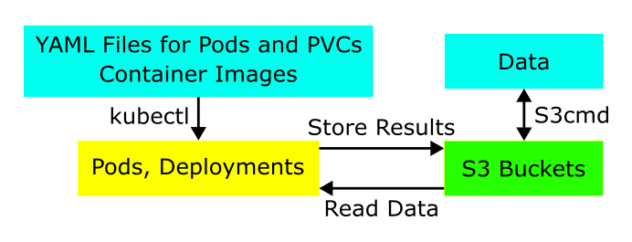

# Gravitational Wave Multiclass Classifier with GASF


This project harnesses the power of Gramian Angular Summation Fields (GASF) in combination with advanced machine learning techniques for the purpose of classifying gravitational wave signals. By transforming time series data into a format that's suitable for image-based classification, the project leverages convolutional neural networks to perform multiclass classification of these signals. The project aims to provide a robust, scalable solution for the automatic categorization of complex gravitational waveforms, thereby aiding scientific communities in their quest to unravel the mysteries of the cosmos.

## Getting Started

### Prerequisites
Copy paste the following command to create the environment to run GWGASF Multiclass Classifier in src/main.py.
```
conda create -n GASF39 python==3.9.18 -y
conda activate GASF39
pip install poetry==1.7.1

cd ../src
poetry install
```


## Retrieving/Loading Data

Since data is loaded from large h5py files, the input data for the model is stored on the [GASF shared Google Drive](https://drive.google.com/drive/folders/12jjEFBU81Y8PB7VUrPHPcZViBhm86obJ?usp=drive_link).


## Using Nautilus
Nautilus is the computing resources we use. One need a UW NetID to access the [PRP Nautilus Portal](https://portal.nrp-nautilus.io/) through CILogon then register for Nautilus. 

### Support in Matrix
- Information of online support: [https://docs.nationalresearchplatform.org/userdocs/start/contact/](https://docs.nationalresearchplatform.org/userdocs/start/contact/)
- Nautilus support channel: [https://element.nrp-nautilus.io/#/room/#general:matrix.nrp-nautilus.io](https://element.nrp-nautilus.io/#/room/#general:matrix.nrp-nautilus.io)

### Creating UW NetID
Once you receive the email, please visit
[https://identity.uw.edu/new/sponsored](https://identity.uw.edu/new/sponsored) to create a UW NetID

### Accessing Nautilus
Please follow the guide here: [https://docs.nationalresearchplatform.org/userdocs/start/get-access/](https://docs.nationalresearchplatform.org/userdocs/start/get-access/) to register for Nautilus.\
The **namespace** we use is "uw-a3d3". Shih-Chieh Hsu <schsu@uw.edu> and Chia-Jui Chou <agoodmanjerry@gmail.com> are the admins. Please contact one of us and provide your registered email on Nautilus so we can add you as one of the users in "uw-a3d3".

### Learning Kubernetes
To use the computing resources provided by Natilus, we have to learn the basics of [Kubernetes](https://kubernetes.io). First, follow the [quickstart](https://docs.nationalresearchplatform.org/userdocs/start/quickstart/) to install kubectl and set the config to access Nautilus.
Then follow the tutorial: [https://docs.nationalresearchplatform.org/userdocs/tutorial/introduction/](https://docs.nationalresearchplatform.org/userdocs/tutorial/introduction/) to learn how to set pods and deployments by kubectl.

### Storage: Ceph S3
Now we need diskspace to store data. We will use CephFS through S3 protocol.  Here is the guide: [https://docs.nationalresearchplatform.org/userdocs/storage/ceph-s3/](https://docs.nationalresearchplatform.org/userdocs/storage/ceph-s3/).\
First, ask for the credentials on the [Matrix](https://element.nrp-nautilus.io/#/room/#general:matrix.nrp-nautilus.io) and install [S3cmd](https://s3tools.org/s3cmd) to create buckets and access the data on S3.

### Workflow
